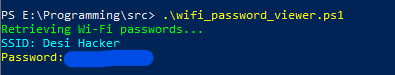

# Wifi-Password-Viewer

## Wi-Fi Password Viewer (Windows)
This PowerShell script retrieves stored Wi-Fi passwords from your Windows system.


## Instructions for Use
1. **Download the script:**
Download the script from [here]()

3. **Run PowerShell as Administrator:** 
To ensure you have the necessary permissions, run PowerShell as an administrator. else it's not working!

5. **Set Execution Policy:** 
If you haven’t set the execution policy to allow scripts to run, you may need to do so:
```
Set-ExecutionPolicy -ExecutionPolicy RemoteSigned -Scope Process
```
  

4. **Run the Script:**
Execute the script in PowerShell:
```
.\wifi_password_viewer.ps1
```

## ScreenShot


## Description
- **SSID:** Displays the name of the Wi-Fi network.
- **Password:** Displays the password associated with the network. If not found, it shows [Not Found].


# License

This project is licensed under the MIT License. See the [LICENSE](LICENSE.md) file for details.


## Last Word 
Happy Learning 🎉📩💖
